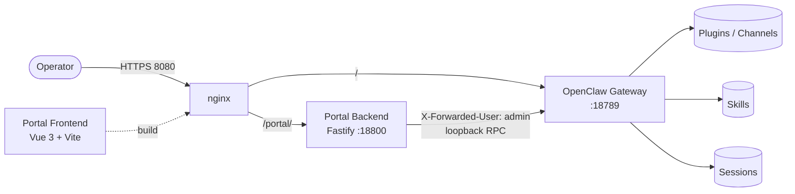

<div align="center">

# OpenClaw Portal

**Self-service management portal for [OpenClaw](https://openclaw.ai) — Vue 3 + Fastify.**

Dashboard, agents, channels, skills, plugins, chat and ops in one Claude-inspired UI.

[](./LICENSE)
[](https://vuejs.org)
[](https://fastify.dev)
[](https://www.typescriptlang.org)

English · [简体中文](./README.zh-CN.md)


</div>

---

## What is this?

OpenClaw Portal is a web UI that sits in front of an OpenClaw gateway and exposes everything a non-terminal operator needs:

- A **dashboard** with live gateway status, system stats, model & channel counts
- An **agent console** for creating, configuring, and running AI agents (model / thinking mode / tools / subagents)
- A **built-in chat** that streams replies, files, images, and text through the gateway WebSocket RPC
- **Channel management** (DingTalk, Feishu/Lark, QQ, WeChat, Lansenger, …) — bind, test, rotate credentials
- **Skills / plugins / MCP / memory / cron** — install, enable, inspect
- **Ops tooling** — logs, terminal, file browser, topology graph, diagnosis, audit, usage metering

Everything runs behind a loopback-only trust boundary: nginx terminates TLS, portal backend talks to the gateway using trusted-proxy headers. No shared secrets in cookies, no token leakage.

## Features

| Area | Views | What you can do |
|---|---|---|
| **Overview** | Dashboard, Monitor, Topology, Diagnosis | See gateway health, model/channel counts, system load, live call graph, run doctor checks |
| **Agents** | Agents, AgentDetail, Sessions, Chat | CRUD agents, per-agent model & thinking mode, tools / subagents config, session replay, streaming chat |
| **Models** | ModelWizard | Add providers (Anthropic / OpenAI / DashScope / Gemini / Ollama…), test, set primary/fallback |
| **Channels** | Channels | Bind IM channels, set webhook / credentials, send test messages, rotate secrets |
| **Extensions** | Skills, Plugins, MCP, Memory, Cron | Install / enable / inspect, upload .skill packs, browse installed skill docs |
| **Ops** | Gateway, Logs, Terminal, FileBrowser, Audit, Activity, Usage, Settings | Start/stop/restart gateway, tail logs, pop a shell, browse workspace, audit trail, cost report |

## Architecture



- **Trust boundary**: portal backend binds loopback only, applies an `onRequest` allowlist guard, and forwards `X-Forwarded-User` from nginx. All three layers must remain intact.
- **Gateway comms**: RPC responses land under `payload` (not `result`); chat goes through the gateway WebSocket, not the model provider directly.
- **Agent scoping**: model / thinking / tools / subagents are stored per-agent under `agents.list[].*`, never via global overrides.

## Screenshots

> Replace these with your own captures — paths are `docs/screenshots/*.png`.

| Dashboard | Channels | Chat |
|:--:|:--:|:--:|
|  |  |  |

| Agents | Skills | Plugins |
|:--:|:--:|:--:|
|  |  |  |

## Quickstart

### Prerequisites

- Node.js 22 or newer
- A running OpenClaw gateway on `127.0.0.1:18789` (see [openclaw.ai](https://openclaw.ai))

### Run locally

```bash
git clone https://github.com/FlyTOmeLight/openclaw-portal.git
cd openclaw-portal
make install   # install backend + frontend deps
make dev       # start both in dev mode with hot reload
```

Open <http://localhost:3000> for the Vite dev server. The backend listens on `http://127.0.0.1:18800` and proxies to the gateway.

### Production build

```bash
make build     # typecheck + bundle
make start     # serve built backend + static frontend
```

## Configuration

| Env var | Default | Purpose |
|---|---|---|
| `PORTAL_PORT` | `18800` | Portal backend listen port |
| `GATEWAY_PORT` | `18789` | OpenClaw gateway port the portal talks to |
| `GATEWAY_HOST` | `127.0.0.1` | Must stay on loopback in production |
| `TRUSTED_PROXY_USER` | `admin` | Username to forward to the gateway via `X-Forwarded-User` |

The portal expects a reverse proxy (nginx) in front of it handling TLS and forwarding the user header. Do **not** expose port 18800 directly on a public interface.

## Development

```
portal/
├── backend/           # Fastify + TypeScript
│   ├── src/
│   │   ├── routes/    # agents, channels, chat, models, plugins, skills, system, …
│   │   └── services/  # channel-manager, config-manager, plugin-manager, process-manager, …
│   └── test/          # vitest
├── frontend/          # Vue 3 + Vite + TypeScript
│   └── src/
│       ├── views/     # Dashboard, Channels, Chat, Agents, Skills, Plugins, ModelWizard, …
│       ├── stores/    # Pinia stores
│       └── api/       # typed API client
├── Makefile
└── docs/
```

Backend tests: `cd backend && npm test`.

## Contributing

Issues and PRs welcome. Before submitting:

1. Read [CLAUDE.md](./CLAUDE.md) (if present) for architecture conventions.
2. Keep the trust boundary intact (loopback bind + onRequest allowlist + proxy header).
3. Gateway RPC responses use `payload`, not `result`.
4. Agent settings belong under `agents.list[].*`.

## License

[MIT](./LICENSE) © 2026 FlyTOmeLight
