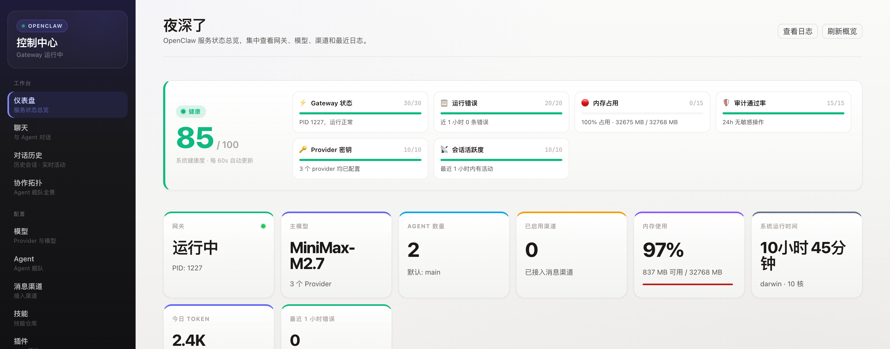
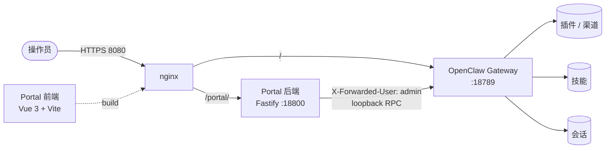
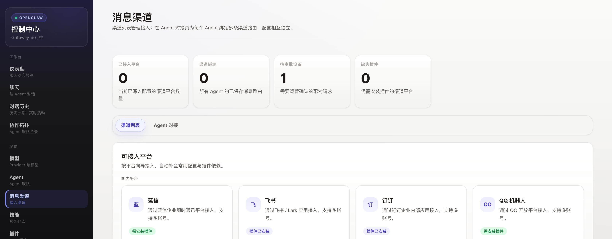
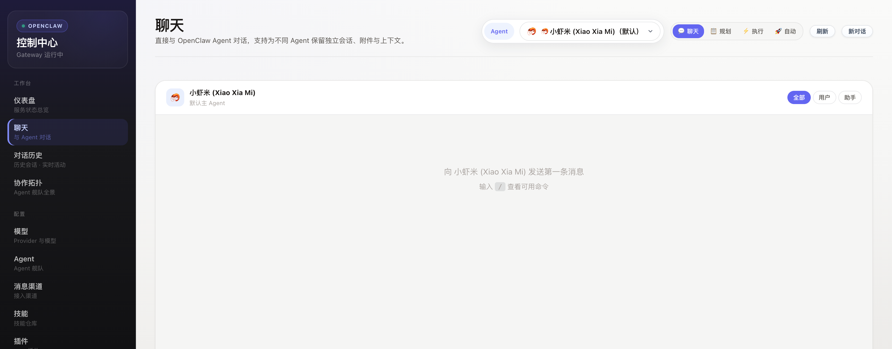
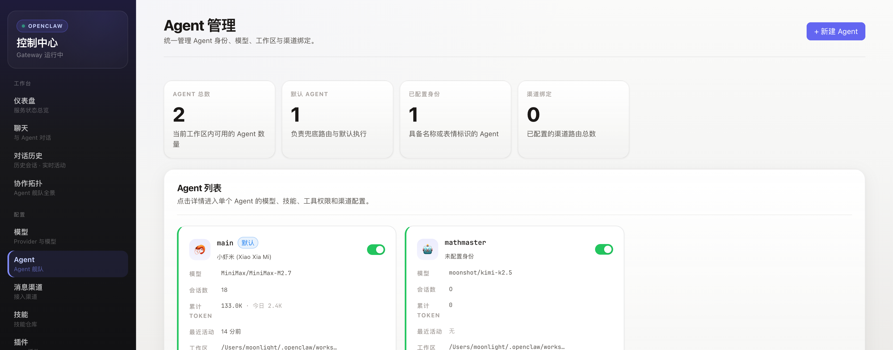
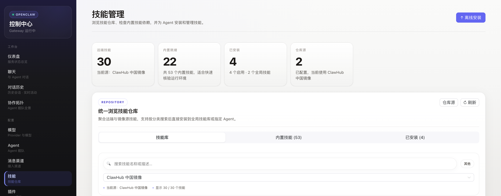
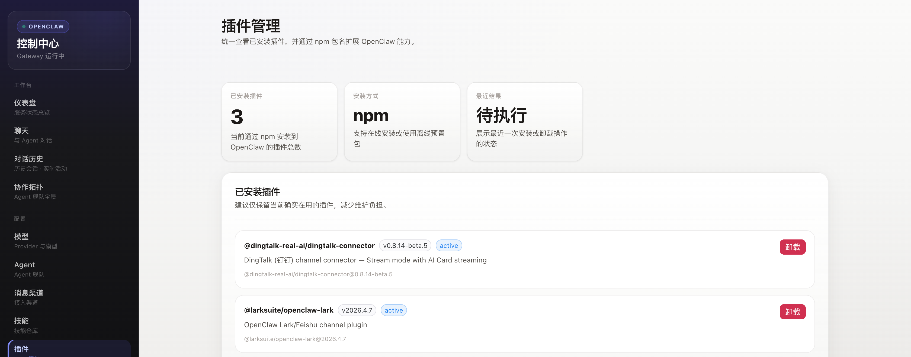

<div align="center">

# OpenClaw Portal

**[OpenClaw](https://openclaw.ai) 自服务管理门户 · Vue 3 + Fastify**

仪表盘、Agent、渠道、技能、插件、对话、运维 —— 一个 Claude 风格 UI 全搞定。

[](https://github.com/FlyTOmeLight/openclaw-portal/actions/workflows/ci.yml)
[](./LICENSE)
[](https://github.com/FlyTOmeLight/openclaw-portal/releases)
[](https://github.com/FlyTOmeLight/openclaw-portal/stargazers)
[](https://github.com/FlyTOmeLight/openclaw-portal/commits/main)
[](https://vuejs.org)
[](https://fastify.dev)
[](https://www.typescriptlang.org)

[English](./README.md) · 简体中文



</div>

---

## 这是什么？

OpenClaw Portal 是一个放在 OpenClaw gateway 前面的 Web UI，把所有需要命令行才能做的事情搬到了浏览器里：

- **仪表盘**：实时 gateway 状态、系统指标、模型 / 渠道数量
- **Agent 控制台**：创建、配置、运行 AI agent（模型 / thinking 模式 / 工具 / 子 agent）
- **内置对话**：通过 gateway WebSocket RPC 流式接收文本、文件、图片
- **渠道管理**：钉钉 / 飞书 / QQ / 微信 / Lansenger …—— 绑定、测试、轮换凭据
- **技能 / 插件 / MCP / memory / cron**：安装、启停、查看
- **运维工具**：日志、终端、文件浏览、拓扑图、诊断、审计、用量计量

所有组件跑在 loopback 信任边界后面：nginx 终结 TLS，portal backend 用 trusted-proxy 头和 gateway 通信。没有共享密钥，没有 token 泄露路径。

## 功能一览

| 领域 | 页面 | 能做什么 |
|---|---|---|
| **概览** | Dashboard、Monitor、Topology、Diagnosis | 查看 gateway 健康、模型 / 渠道数量、系统负载、实时调用图、一键 doctor 自检 |
| **Agent** | Agents、AgentDetail、Sessions、Chat | Agent CRUD、每个 agent 独立模型 / thinking、工具 / 子 agent 配置、会话回放、流式对话 |
| **模型** | ModelWizard | 接入各家模型（Anthropic / OpenAI / DashScope / Gemini / Ollama…）、测试、设置主备 |
| **渠道** | Channels | 绑定 IM 渠道、配置 webhook / 凭据、发送测试消息、轮换密钥 |
| **扩展** | Skills、Plugins、MCP、Memory、Cron | 安装 / 启停 / 查看、上传 .skill 包、浏览已装技能文档 |
| **运维** | Gateway、Logs、Terminal、FileBrowser、Audit、Activity、Usage、Settings | 启停重启 gateway、tail 日志、弹出 shell、浏览 workspace、审计轨迹、成本报表 |

## 架构



- **信任边界**：portal 后端只绑定 loopback，`onRequest` 白名单守卫，nginx 透传 `X-Forwarded-User`。三层守卫不得被破坏。
- **Gateway 通信**：RPC 响应数据在 `payload` 字段（不是 `result`）；对话走 gateway WebSocket，不直接调模型厂商。
- **Agent 作用域**：模型 / thinking / 工具 / 子 agent 配置按 agent 独立存储在 `agents.list[].*`，不用全局覆盖。

## 截图

| 仪表盘 | 渠道 | 对话 |
|:--:|:--:|:--:|
|  |  |  |

| Agent | 技能 | 插件 |
|:--:|:--:|:--:|
|  |  |  |

## 快速开始

### 前置要求

- Node.js 22+（或 Docker 24+）
- 一个运行在 `127.0.0.1:18789` 的 OpenClaw gateway（见 [openclaw.ai](https://openclaw.ai)）

### 🐳 Docker（最简单）

```bash
git clone https://github.com/FlyTOmeLight/openclaw-portal.git
cd openclaw-portal
docker compose up -d
```

打开 <http://localhost:18800>。容器用 `network_mode: host`，可以直接访问 loopback 上的 gateway。

### 🧑‍💻 本地开发（热加载）

```bash
git clone https://github.com/FlyTOmeLight/openclaw-portal.git
cd openclaw-portal
make install   # 装前后端依赖
make dev       # 前后端热加载并启动
```

打开 <http://localhost:5173/portal/>。Vite 在 `:5173` 上以 `/portal/` 为基路径提供前端，并把 API 请求反代到 `127.0.0.1:18800` 的后端。

### 生产构建（不用 Docker）

```bash
make build     # typecheck + 打包
make start     # 起后端并托管前端静态资源
```

## 配置

| 环境变量 | 默认值 | 作用 |
|---|---|---|
| `PORTAL_PORT` | `18800` | Portal 后端监听端口 |
| `GATEWAY_PORT` | `18789` | OpenClaw gateway 端口 |
| `GATEWAY_HOST` | `127.0.0.1` | 生产环境必须留在 loopback |
| `TRUSTED_PROXY_USER` | `admin` | 通过 `X-Forwarded-User` 透传给 gateway 的用户名 |

portal 要求前面放一个反向代理（nginx）负责 TLS 和用户头透传。**不要**把 18800 端口直接暴到公网。

## 开发

```
portal/
├── backend/           # Fastify + TypeScript
│   ├── src/
│   │   ├── routes/    # agents、channels、chat、models、plugins、skills、system …
│   │   └── services/  # channel-manager、config-manager、plugin-manager、process-manager …
│   └── test/          # vitest
├── frontend/          # Vue 3 + Vite + TypeScript
│   └── src/
│       ├── views/     # Dashboard、Channels、Chat、Agents、Skills、Plugins、ModelWizard …
│       ├── stores/    # Pinia stores
│       └── api/       # 类型化 API client
├── Makefile
└── docs/
```

后端测试：`cd backend && npm test`。

## 参与贡献

欢迎 issue、PR、设计反馈 —— 看 [CONTRIBUTING.md](./CONTRIBUTING.md)。想找低上下文入口可以看 [`good first issue`](https://github.com/FlyTOmeLight/openclaw-portal/issues?q=is%3Aissue+is%3Aopen+label%3A%22good+first+issue%22) 列表。请遵守 [Code of Conduct](./CODE_OF_CONDUCT.md)。

代码评审强制要求：

1. 保留信任边界三层守卫（loopback 绑定 + `onRequest` 白名单 + `X-Forwarded-User`）不被破坏
2. gateway RPC 响应取 `payload`，不是 `result`
3. agent 配置都放在 `agents.list[].*` 下

## 路线图

- [ ] i18n：中英文 UI 切换（目前仅中文）
- [ ] 除 trusted-proxy 外支持 OAuth / SSO 登录
- [ ] 加 Prometheus `/metrics`
- [ ] 渠道事件实时推送通知
- [ ] 所有页面深色模式完善

有想法？开个 [Discussion](https://github.com/FlyTOmeLight/openclaw-portal/discussions/new?category=ideas)。

## Star 走势

[](https://star-history.com/#FlyTOmeLight/openclaw-portal&Date)

## 协议

[MIT](./LICENSE) © 2026 FlyTOmeLight
